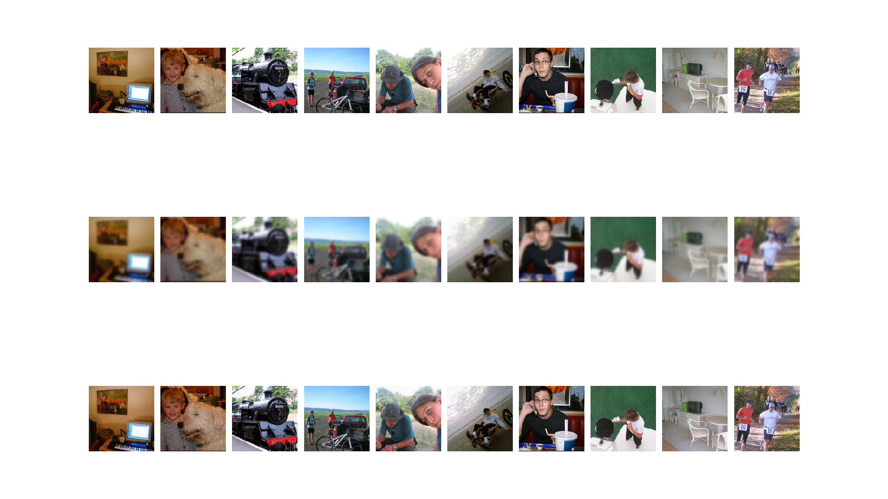

# Image Enhancer

With this Image Enhancer, you can:

+ reduce image noise
+ enhance resolution ratio
+ and so on

## Examples

Image source: Pascal VOC 2012, Image shape: 128, 128, 3

Learning rate: 0.01, Batch size: 128, Epoch: 50

Model: denoise, Corruption type: GSN (Gaussian Noise), Ratio: 2%

Model: denoise, Corruption type: GSB (Gaussian Blur), Ratio: 2x

Model: augment, Corruption type: ZIP

## Usage:

Simplest (model, input directory, and image shape are required)

    python run.py -m denoise -i ~/data/images/ -s 96 96 3

Specify hyperparameters (learning rate, batch size, epoches)

    python run.py -m denoise -i ~/data/images/ -s 96 96 3 -r 0.001 -b 128 -e 50

Specify corruption types and/or ratio

    python run.py -m augment -i ~/data/images/ -s 96 96 3 -T ZIP
    python run.py -m denoise -i ~/data/images/ -s 96 96 3 -T GSN -R 0.05

*Till now, there are several corruption types:*
+ **_GSN_** Gaussian Noise
+ **_MSN_** Masking Noise
+ **_SPN_** Salt & Pepper Noise
+ **_GSB_** Gaussian Blur
+ **_ZIP_** Zip image as half of original resolution

Specify file path

    python run.py -m denoise -i ~/data/images/ -s 96 96 3 --graph-path ./graphs/ --checkpoint-path ./checkpoints/ --example-path ./examples/

Training on CPU

    python run.py -m denoise -i ~/data/images/ -s 96 96 3 --cpu-only

## References

Main reference:

    @article{Dong:2016,
        author = {Dong, Jianfeng and Mao, Xiao-Jiao and Shen, Chunhua and Yang, Yu-Bin},
        title = {Unsupervised Feature Learning With Symmetrically Connected Convolutional Denoising Auto-encoders},
        journal = {CoRR},
        volume = {abs/1611.09119},
        url = {http://arxiv.org/abs/1611.09119},
        year = {2016},
        type = {Journal Article}
    }

Some papers about autoencoder and denoising autoencoder:

    @article{Vincent:2010,
        author = {Vincent, Pascal and Larochelle, Hugo and Lajoie, Isabelle and Bengio, Yoshua and Manzagol, Pierre-Antoine},
        title = {Stacked Denoising Autoencoders: Learning Useful Representations in a Deep Network with a Local Denoising Criterion},
        journal = {J. Mach. Learn. Res.},
        volume = {11},
        pages = {3371-3408},
        ISSN = {1532-4435},
        year = {2010},
        type = {Journal Article}
    }

    @inproceedings{Germain:2015,
        author = {Germain, Mathieu and Gregor, Karol and Murray, Iain and Larochelle, Hugo},
        title = {MADE: Masked Autoencoder for Distribution Estimation},
        booktitle = {Proceedings of the 32Nd International Conference on International Conference on Machine Learning - Volume 37},
        series = {ICML'15},
        year = {2015},
        location = {Lille, France},
        pages = {881--889},
        numpages = {9},
        url = {http://dl.acm.org/citation.cfm?id=3045118.3045213},
        acmid = {3045213},
        publisher = {JMLR.org},
    }

Some famous CNN papers:

    @article{Krizhevsky:2017,
        author = {Krizhevsky, Alex and Sutskever, Ilya and Hinton, Geoffrey E.},
        title = {ImageNet Classification with Deep Convolutional Neural Networks},
        journal = {Commun. ACM},
        issue_date = {June 2017},
        volume = {60},
        number = {6},
        month = may,
        year = {2017},
        issn = {0001-0782},
        pages = {84--90},
        numpages = {7},
        url = {http://doi.acm.org/10.1145/3065386},
        doi = {10.1145/3065386},
        acmid = {3065386},
        publisher = {ACM},
        address = {New York, NY, USA},
    }

    @article{Simonyan:2014,
        author    = {Simonyan, Karen and Zisserman, Andrew},
        title     = {Very Deep Convolutional Networks for Large-Scale Image Recognition},
        journal   = {CoRR},
        volume    = {abs/1409.1556},
        year      = {2014},
        url       = {http://arxiv.org/abs/1409.1556},
        archivePrefix = {arXiv},
        eprint    = {1409.1556},
        timestamp = {Wed, 07 Jun 2017 14:41:51 +0200},
        biburl    = {http://dblp.org/rec/bib/journals/corr/SimonyanZ14a},
        bibsource = {dblp computer science bibliography, http://dblp.org}
    }

Deep Residual Network:

    @INPROCEEDINGS{He:2016,
        author={He, Kaiming and Zhang, Xiangyu and Ren, Shaoqing and Sun, Jian},
        booktitle={2016 IEEE Conference on Computer Vision and Pattern Recognition (CVPR)},
        title={Deep Residual Learning for Image Recognition},
        year={2016},
        volume={},
        number={},
        pages={770-778},
        keywords={image classification;learning (artificial intelligence);neural nets;object detection;CIFAR-10;COCO object detection dataset;COCO segmentation;ILSVRC & COCO 2015 competitions;ILSVRC 2015 classification task;ImageNet dataset;ImageNet localization;ImageNet test set;VGG nets;deep residual learning;deep residual nets;deeper neural network training;image recognition;residual function learning;residual nets;visual recognition tasks;Complexity theory;Degradation;Image recognition;Image segmentation;Neural networks;Training;Visualization},
        doi={10.1109/CVPR.2016.90},
        ISSN={},
        month={June}
    }
